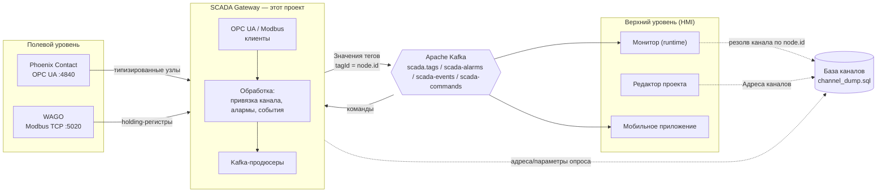
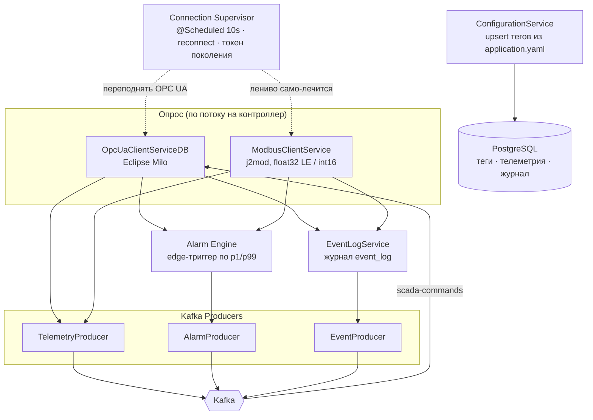
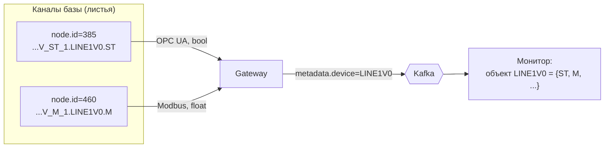
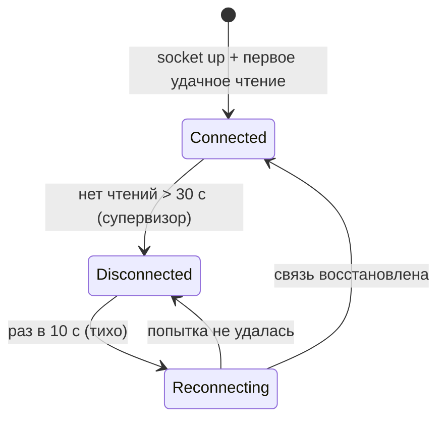
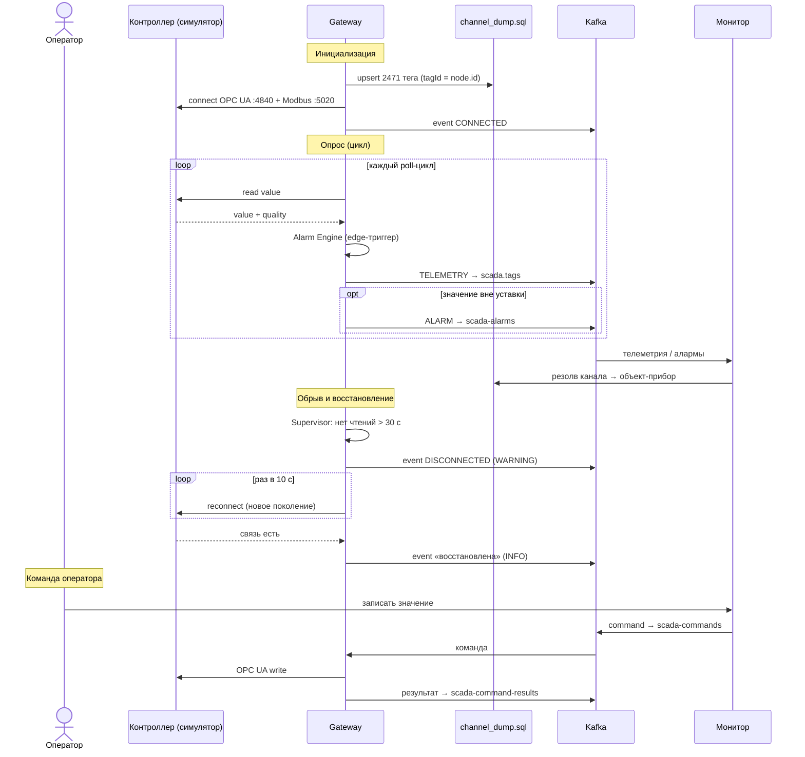
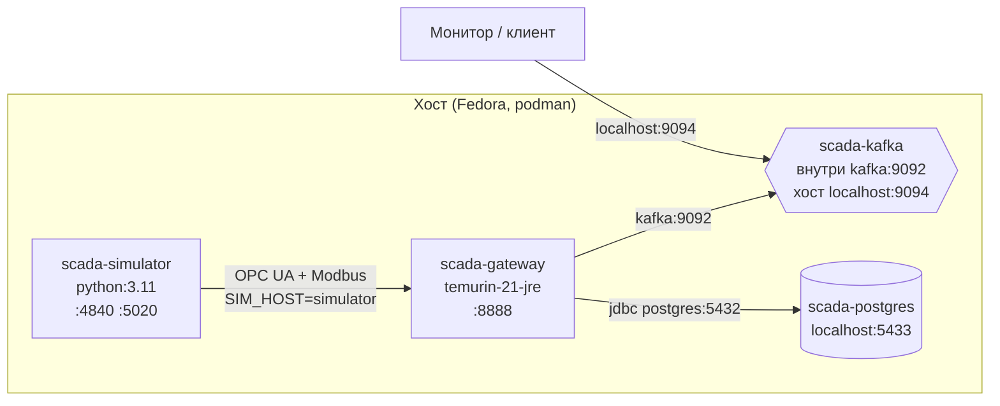

# SCADA Gateway — спецификация

> Промышленный шлюз сбора данных: опрашивает контроллеры ПЛК по **OPC UA**, **Modbus TCP**
> и **PAC** (driver-master), привязывает сигналы к общей **базе каналов** и публикует телеметрию,
> события и алармы в **Apache Kafka** для монитора, редактора и мобильного приложения.

| | |
|---|---|
| **Технологии** | Spring Boot 3.5.16 · Java 21 · Eclipse Milo (OPC UA) · j2mod (Modbus) · LuaJ (PAC) · Spring Kafka · PostgreSQL 16 |
| **Протоколы поля** | OPC UA (типизированные узлы), Modbus TCP (holding-регистры, float32 LE / int16), PAC (driver-master, Savushkin/ptusa: TCP + zlib(Lua), опрос через LuaJ) |
| **Шина** | Apache Kafka (KRaft), JSON-сообщения |
| **База каналов** | `channel_dump.sql` — PostgreSQL EAV, идентичность канала = `node.id` |
| **Стенд** | PLC-симулятор (Python) проигрывает 5-суточный архив `BN1_MCA1` в реальном времени |
| **Развёртывание** | `docker compose` — одна команда `./up.sh` |

---

## Содержание

1. [Назначение и границы](#1-назначение-и-границы)
2. [Место в архитектуре продукта](#2-место-в-архитектуре-продукта)
3. [Внутреннее устройство шлюза](#3-внутреннее-устройство-шлюза)
4. [Модель данных и привязка к базе каналов](#4-модель-данных-и-привязка-к-базе-каналов)
5. [Контроллеры и протоколы](#5-контроллеры-и-протоколы)
6. [PLC-симулятор и архив](#6-plc-симулятор-и-архив)
7. [Форматы сообщений Kafka](#7-форматы-сообщений-kafka)
8. [Надёжность: reconnect, журнал, события, алармы](#8-надёжность-reconnect-журнал-события-алармы)
9. [Поток данных](#9-поток-данных)
10. [Развёртывание](#10-развёртывание)
11. [Конфигурация](#11-конфигурация)
12. [Эксплуатация](#12-эксплуатация)
13. [Приложение: типы устройств и счётчики](#13-приложение-типы-устройств-и-счётчики)

---

## 1. Назначение и границы

**SCADA Gateway** — средний слой АСУ ТП между полевым уровнем (контроллеры ПЛК) и верхним
уровнем (SCADA HMI: монитор, редактор, мобильное приложение). Задачи шлюза:

- **Сбор** — циклический опрос контроллеров по трём промышленным протоколам одновременно.
- **Нормализация** — приведение сырых значений (типизированные OPC UA-узлы, Modbus-регистры)
  к единому виду и привязка к каналу общей базы по `node.id`.
- **Единая идентичность** — привязка каждого сигнала к сквозному `node.id` (= Kafka-key),
  по которому монитор собирает разрозненные каналы обратно в объект-устройство. Объектную
  модель (device/field/type) монитор берёт из СВОЕГО реестра по ключу — на проводе её нет.
- **Диагностика** — авто-переподключение, журнал событий, edge-триггерные алармы по уставкам.
- **Публикация** — телеметрия/события/алармы в Kafka; приём команд записи от оператора.

Что **вне** шлюза: визуализация, скрипты и мнемосхемы (монитор/редактор), хранение топологии
(мобильный сервер). Шлюз не хранит бизнес-логику мнемосхем — только конвейер данных.

---

## 2. Место в архитектуре продукта



Шлюз — единственный компонент, который «видит» контроллеры. Всё остальное общается через Kafka
и общую базу каналов. Идентичность сигнала сквозная: `tagId = channel.node.id`, поэтому монитор
резолвит канал в той же базе, которую наполняет редактор.

---

## 3. Внутреннее устройство шлюза



| Компонент | Класс | Ответственность |
|---|---|---|
| Конфигурация | `ConfigurationService` | Читает `application.yaml`, делает upsert контроллеров и 2471 тега в БД (ключ — `nodeId`), удаляет устаревшие. |
| OPC UA клиент | `OpcUaClientServiceDB` | Опрос по потоку на контроллер, чтение типизированных узлов, оценка связи по циклу, супервизор reconnect. |
| Modbus клиент | `ModbusClientService` | Чтение holding-регистров (`float32` little-endian, `int16`), пул соединений с backoff. |
| PAC клиент | `PacClientService` | Опрос PAC-контроллеров (`driver-master`): TCP + `zlib(Lua)`, исполнение присланного Lua через LuaJ, чтение значений из таблицы `tags` по `channelId`, пул соединений. |
| Алармы | `evaluateAlarms()` | Edge-триггер по `minValue`/`maxValue`, гистерезис (deadband 2 %), severity MINOR/MAJOR/CRITICAL. |
| Журнал | `EventLogService` | Пишет в `event_log`: соединения, смена качества, алармы, системные события. |
| Продюсеры | `TelemetryProducer`, `AlarmProducer`, `EventProducer` | Сериализация DTO и отправка в топики Kafka. |
| Команды | `writeTag()` | Запись команды или уставки по OPC UA / PAC по команде оператора (Modbus — только чтение; writable-проверка: датчик RO не перезаписать), ответ в `scada-command-results`. |

---

## 4. Модель данных и привязка к базе каналов

**База каналов `channel_dump.sql`** — PostgreSQL-дамп схемы `channel` (EAV):

| Таблица | Роль |
|---|---|
| `node(id, id_node)` | Дерево каналов; `id` — последовательный PK, `id_node` — полный путь. Лист дерева = канал. |
| `param(id, id_node, id_type, value, kafka_key, kafka_topic)` | Параметры узла (задел под привязку к Kafka). |
| `description` | Каталог типов (19). |
| `template_node` / `template_param` | Шаблоны (dev / sub / cha / clear). |

Масштаб: **3449 узлов**, из них **2471 листовых канала (тега)**, **17542 параметра**.

**Сквозная идентичность.** В Kafka уходит:

- `tagId = channel.node.id` — по нему монитор резолвит канал в общей базе;
- `tagName = channel.id_node` — полный путь, например `Барановичи-1.BN1_MCA1.V_M_1.LINE1V0.M`;
- `metadata = {device, field, deviceType}` — разложение канала на прибор/поле.

**Объектная модель прибора.** Канал именуется как `<прибор>.<поле>`, поле закодировано в подтипе
(`V_ST_1` → тип `V`, поле `ST`, линия 1). Один прибор (напр. клапан `LINE1V0`) — это набор каналов
`LINE1V0.ST`, `LINE1V0.M`, … Шлюз шлёт каждое поле отдельным сообщением с общим `metadata.device`,
а **монитор собирает прибор обратно в объект** — даже если поля пришли по разным протоколам
(`ST` по OPC UA, `M` по Modbus).



---

## 5. Контроллеры и протоколы

Реальные **2471 канала** разложены на **два контроллера** — целый прибор всегда на одном контроллере:

| Контроллер | id | Протокол | Endpoint | Каналов | Типы приборов |
|---|---|---|---|---|---|
| **Phoenix Contact** | `phoenix-contact-001` | OPC UA | `opc.tcp://${SIM_HOST}:4840` | 594 | V, VC, M, LS, FS, GS, DI, DO, HA, HL, SB |
| **WAGO** | `wago-001` | Modbus TCP | `modbus://${SIM_HOST}:5020` | 1877 | QT, PT, TE, LT, AI, AO, FQT, WT, объекты/рецепты |

Итого **2471 канал** (307 `BOOLEAN` + 2164 `FLOAT`).

**OPC UA (Eclipse Milo).** Приборы представлены как объект-узлы с типизированными переменными-полями
(`ns=2;s=<node.id>`). Шлюз читает значение и качество, различает `GOOD`/`BAD` по `StatusCode`.

**Modbus TCP (j2mod).** Поля — holding-регистры: `FLOAT` = 2 регистра `float32` **little-endian**
(как `struct.pack('<f')`), `BOOLEAN`/`INT16` = 1 регистр. Адресация `40001 → 0`.

**PAC (driver-master, Savushkin/ptusa) — третий протокол.** Реальные PAC-контроллеры завода
говорят по протоколу `driver-master` поверх TCP (порт 10000): кадр `'s'`+ServiceID+pidx+BE16-len,
тело ответа — `zlib(Lua-скрипт)`. Шлюз (`PacClientService`) исполняет присланный Lua через **LuaJ**
и читает значения из таблицы `tags` по `channelId`; команды оператора — `EXEC_DEVICE_COMMAND` с
Lua `set_cmd`. Опрашивается тем же конвейером, что OPC UA/Modbus. В стенде это отдельный
**демо-контроллер PAC** (`pac://${SIM_HOST}:10000`, 7 синтетических тегов `channelId 9001–9007`) —
сверх 2471 архивного канала; сим поднимает PAC-сервер в том же процессе.

---

## 6. PLC-симулятор и архив

В стенде роль контроллеров играет **PLC-симулятор** (`plc-simulator/plc.py`), который поднимает
OPC UA-сервер (:4840), Modbus TCP-сервер (:5020) и PAC-сервер (:10000, driver-master) в одном процессе.

- **Источник значений** — реальный архив `BN1_MCA1` (станция Барановичи-1): 170 временных рядов
  (`cid`), 5 суток, событийная запись. Собран в `data/archive_replay.pkl.gz`.
- **Воспроизведение** — в реальном времени (`speed = 1.0`), zero-order hold, зацикленно.
  Ряды архива **дублируются** по каналам (режим полного заполнения — задействованы все 2471),
  источник архива развязан от `nodeId` полем `replay_source`.
- **Формат** — как у реальных контроллеров (типизированные узлы / регистры), **не** плоский дамп
  архива. Ориентир формата — прошивка `ptusa_main` (`device::save_device`: `ИМЯ={M=,ST=,V=,…}`).

> Симулятор синтезирует «сырые» данные в формате контроллера; **всю обработку делает шлюз**.

---

## 7. Форматы сообщений Kafka

Все сообщения — JSON. Ключ сообщения телеметрии = путь канала.

### TelemetryMessage → `scada.tags`

Полный формат провода — минимальный триплет (аналог OPC UA `DataValue`): **значение
+ качество + время**. Больше в теле НЕТ ничего.

```json
{
  "value": 1.07,
  "quality": "GOOD",
  "timestamp": "2026-07-28T09:36:37.160Z"
}
```

- **`value`** идёт ТИПИЗИРОВАННЫМ (число/bool, не строкой) — монитор строит график по числу.
- **`timestamp`** — момент снятия значения (`Instant`): sourceTime у OPC UA, момент чтения у Modbus.
- Идентичность тега несёт **Kafka-key = путь канала** (`tag.getName()`, напр.
  `Барановичи-1.BN1_MCA1.V_M_1.LINE1V0.M`), а НЕ тело сообщения.
- Всё статическое — единицы, прибор/поле/тип, контроллер — монитор достраивает из
  СВОЕГО реестра каналов по этому ключу; на проводе этого нет. Так поток лёгкий, а
  дисплей монитора не завязан на схему БД шлюза (см. `TelemetryMessage`, `TelemetryProducer`).

### AlarmMessage → `scada-alarms`
```json
{
  "messageId": "uuid", "type": "ALARM",
  "alarmId": "ALARM_882_LOW_1785218215039",
  "tagId": 882, "tagName": "...FQT_M.LINE3FQT1.M",
  "severity": "MINOR", "message": "Low value: 10.70 < 11.20",
  "threshold": 11.2, "currentValue": 10.7,
  "timestamp": 1785218215.04, "acknowledged": false, "cleared": false,
  "controllerId": 2, "controllerName": null
}
```
`cleared:false` — постановка аларма; `cleared:true` — снятие при возврате в норму.

### EventMessage → `scada-events`
```json
{
  "messageId": "uuid", "type": "EVENT",
  "eventType": "CONNECTION", "source": "OpcUaClient", "severity": "WARNING",
  "message": "Потеряна связь с Phoenix Contact: супервизор: нет удачных чтений > 30 c",
  "timestamp": 1785218213.81,
  "details": { "controller": "Phoenix Contact", "state": "DISCONNECTED" }
}
```

### Топики

| Топик | Направление | Содержимое |
|---|---|---|
| `scada.tags` | шлюз → монитор | значения тегов |
| `scada-alarms` | шлюз → монитор | постановка/снятие алармов |
| `scada-events` | шлюз → монитор | соединения, качество, системные события |
| `scada-commands` | монитор → шлюз | команды записи значения |
| `scada-command-results` | шлюз → монитор | результат выполнения команды |

---

## 8. Надёжность: reconnect, журнал, события, алармы

### Авто-переподключение (супервизор)
`@Scheduled(10s)` `superviseConnections()` для каждого OPC UA-контроллера: если клиент мёртв
**или** нет удачных чтений > 30 c («тихая» смерть сессии) — переподключение. Modbus само-лечится
лениво в `getConnection` (backoff 2 c). Супервизор сам фиксирует `DISCONNECTED` перед reconnect —
иначе при зависших (не падающих) чтениях не было бы ни события обрыва, ни восстановления.

### Токен поколения (защита от flapping)
`runningStatus` общий по контроллеру: при reconnect старый и новый поток опроса могли жить
одновременно и «дёргать» состояние связи. Введён **`pollGeneration`** — каждый новый поток
получает своё поколение; только текущее поколение правит состояние. Итог: ровно **1 DISCONNECTED
и 1 «восстановлена»** на инцидент.



### Логирование и журнал
- Уровень `INFO`; per-tag значения — в `debug`; Modbus-ошибки троттлятся **по времени** (≤ 1/30 c).
- При обрыве вместо десятков тысяч строк — единицы; сводка здоровья раз в 60 c:
  `📋 Здоровье связи: 2/2 на связи [🟢 Phoenix Contact, 🟢 WAGO]`.
- **Журнал** (`event_log` в БД): соединения (CONNECTING/CONNECTED/DISCONNECTED), смена качества
  тега, алармы, системные события.

### Алармы (edge-триггер)
Уставки `minValue`/`maxValue` для аналоговых каналов рассчитаны как **перцентили p1/p99** серии
архива, привязанной к каналу (1962 из 2164 FLOAT-тегов). Так редкие всплески (~1–2 %) выбивают
аларм. Аларм ставится **один раз** при выходе за предел и снимается один раз при возврате в норму
с гистерезисом (deadband 2 % диапазона). Severity: ниже `min` → MINOR/MAJOR, выше `max` → MAJOR/CRITICAL.

---

## 9. Поток данных



---

## 10. Развёртывание

Весь стек поднимается **одной командой**:

```bash
cd scada-gateway
./up.sh                 # соберёт jar (если надо) и поднимет всё в фоне
./up.sh --logs          # то же + прицепиться к логам шлюза
./up.sh down            # остановить (данные БД сохранятся)
./up.sh down -v         # остановить и стереть БД
```



| Сервис | Образ | Порт на хост |
|---|---|---|
| postgres | `postgres:16` | 5433 |
| kafka | `apache/kafka` (KRaft, dual-listener) | **9094** (для монитора) |
| simulator | build `./plc-simulator` (python 3.11) | 4840 / 5020 |
| gateway | build `./SCADA-gateway` (готовый jar в JRE 21) | 8888 |

`up.sh` сам поднимает `podman.socket` и указывает `DOCKER_HOST` — на Fedora рабочий бэкенд
нативный podman (Docker Desktop QEMU нестабилен). Топики Kafka авто-создаются брокером.

---

## 11. Конфигурация

**`application.yaml`** (ключевые секции):

```yaml
kafka:
  enabled: true
  publish: { events: true, alarms: true }
  topics:
    telemetry: scada.tags
    alarms: scada-alarms
    events: scada-events
    commands: scada-commands
    command-results: scada-command-results

opcua:
  servers:
    - id: phoenix-contact-001        # OPC UA
      endpoint: "opc.tcp://${SIM_HOST:127.0.0.1}:4840"
      tags: [ { name, nodeId, channelId, deviceName, fieldName, deviceType,
                dataType, minValue, maxValue, pollingRate }, ... ]
    - id: wago-001                   # Modbus TCP
      endpoint: "modbus://${SIM_HOST:127.0.0.1}:5020"
      tags: [ { ..., protocol: modbus, modbusAddress, modbusType }, ... ]
```

**Env-переопределения** (для Docker; см. `docker-compose.yml`):

| Переменная | Назначение |
|---|---|
| `SPRING_DATASOURCE_URL` | адрес PostgreSQL (`jdbc:postgresql://postgres:5432/scada_db`) |
| `SPRING_KAFKA_BOOTSTRAP_SERVERS` | брокер (`kafka:9092`) |
| `SIM_HOST` | хост контроллеров/симулятора (`simulator`) — подставляется в оба endpoint |

Параметры супервизора и логов: `gateway.supervise-interval-ms` (10000),
`gateway.health-log-interval-ms` (60000); порог staleness — 30 c.

---

## 12. Эксплуатация

```bash
# здоровье шлюза
curl -s http://localhost:8888/actuator/health          # {"status":"UP"}

# что уходит в Kafka (с хоста, external listener)
docker exec scada-kafka /opt/kafka/bin/kafka-console-consumer.sh \
  --bootstrap-server localhost:9094 --topic scada.tags --max-messages 5

# логи шлюза
docker compose logs -f gateway
```

Проверка авто-reconnect: остановить симулятор (`docker stop scada-simulator`) — в логах ровно один
`🔴 Потеряна связь`, событие `DISCONNECTED` в `scada-events`; запустить снова — один
`🟢 связь восстановлена`.

---

## 13. Приложение: типы устройств и счётчики

**Типы приборов** (из прошивки `ptusa_main`, поле `deviceType`):

| Код | Прибор | Ключевые поля |
|---|---|---|
| `V`, `VC` | клапан / клапан-регулятор | `ST` (состояние), `M` (ручной), `FB_ON_ST`/`FB_OFF_ST` |
| `M` | мотор | `ST`, `R`, `FRQ`, `RPM` |
| `LS`, `LT` | уровень (датчик / трансмиттер) | `ST`, `CLEVEL` |
| `TE` | температура | `V` |
| `FS`, `FQT` | поток / счётчик потока | `ST`, `ABS_V`, `DAY_T*` |
| `QT` | концентрация | `V`, `OK` |
| `AI`, `AO`, `DI`, `DO` | аналог/дискрет вход-выход | `V` / `ST` |
| `HA`, `HL`, `SB` | авария / индикация / кнопка | `ST` |

**Счётчики стенда:**

| Метрика | Значение |
|---|---|
| Узлов в базе каналов | 3449 |
| Каналов (тегов) | 2471 |
| — из них `BOOLEAN` / `FLOAT` | 307 / 2164 |
| Параметров | 17542 |
| Каналов на Phoenix (OPC UA) / WAGO (Modbus) | 594 / 1877 |
| Серий архива | 170 (5 суток) |
| FLOAT-тегов с уставками алармов | 1962 |

---

*Текстовая UML-схема (component / sequence / deployment) — в `docs/architecture.puml`.
Общая схема продукта — `Архитектура_SCADA_расширенная.drawio`.*
