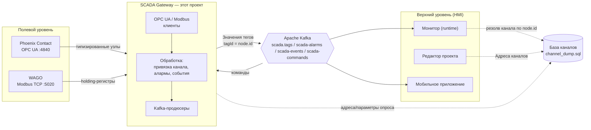
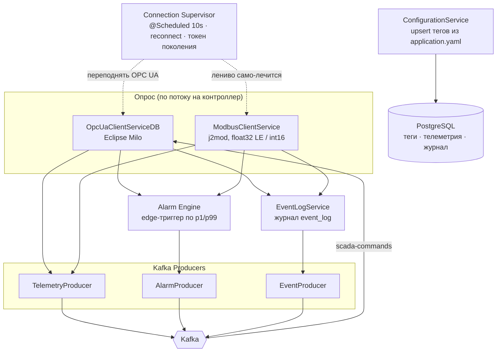
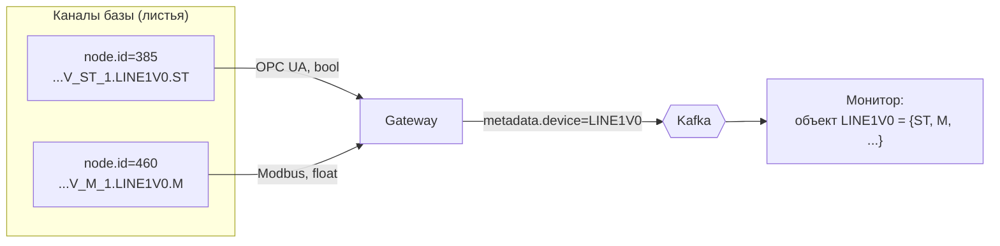
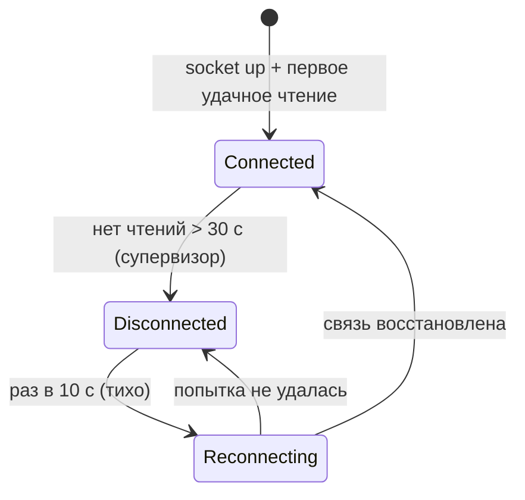
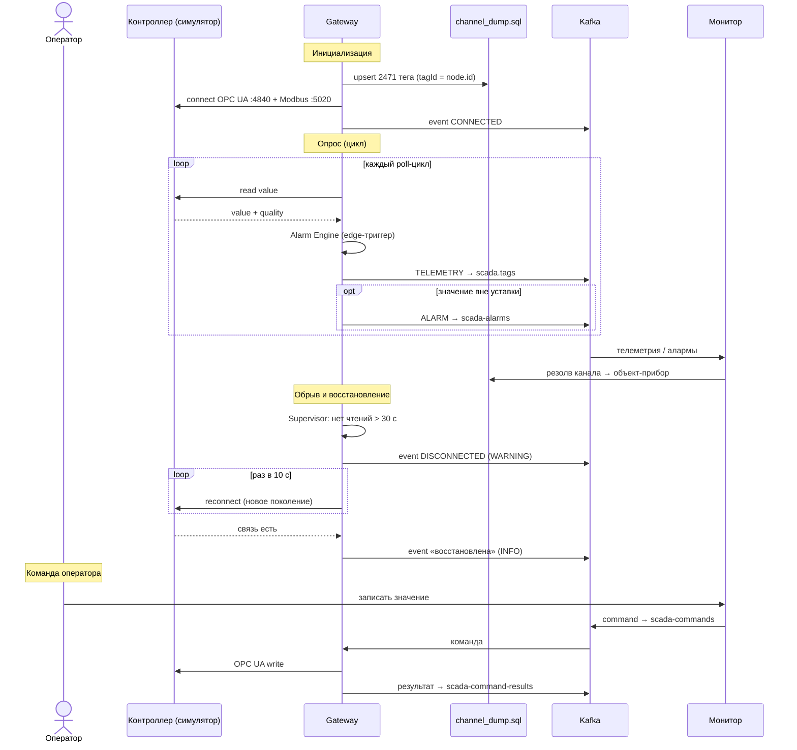
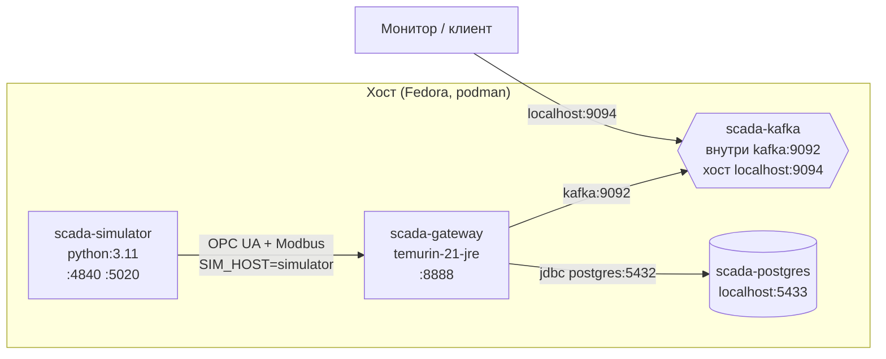

# SCADA Gateway — спецификация

> Промышленный шлюз сбора данных: опрашивает контроллеры ПЛК по **OPC UA**, **Modbus TCP**
> и **PAC** (driver-master), привязывает сигналы к общей **базе каналов** и публикует телеметрию,
> события и алармы в **Apache Kafka** для монитора, редактора и мобильного приложения.

| | |
|---|---|
| **Технологии** | Spring Boot 3.5.16 · Java 21 · Eclipse Milo (OPC UA) · j2mod (Modbus) · LuaJ (PAC) · Spring Kafka · PostgreSQL 16 |
| **Протоколы поля** | OPC UA (типизированные узлы), Modbus TCP (holding-регистры, float32 LE / int16), PAC (driver-master, Savushkin/ptusa: TCP + zlib(Lua), опрос через LuaJ) |
| **Шина** | Apache Kafka (KRaft), JSON-сообщения |
| **База каналов** | `channel_dump.sql` — PostgreSQL EAV, идентичность канала = `node.id` |
| **Стенд** | PLC-симулятор (Python) проигрывает 5-суточный архив `BN1_MCA1` в реальном времени |
| **Развёртывание** | `docker compose` — одна команда `./up.sh` |

---

## Содержание

1. [Назначение и границы](#1-назначение-и-границы)
2. [Место в архитектуре продукта](#2-место-в-архитектуре-продукта)
3. [Внутреннее устройство шлюза](#3-внутреннее-устройство-шлюза)
4. [Модель данных и привязка к базе каналов](#4-модель-данных-и-привязка-к-базе-каналов)
5. [Контроллеры и протоколы](#5-контроллеры-и-протоколы)
6. [PLC-симулятор и архив](#6-plc-симулятор-и-архив)
7. [Форматы сообщений Kafka](#7-форматы-сообщений-kafka)
8. [Надёжность: reconnect, резервирование, журнал, события, алармы](#8-надёжность-reconnect-резервирование-журнал-события-алармы)
9. [Поток данных](#9-поток-данных)
10. [Развёртывание](#10-развёртывание)
11. [Конфигурация](#11-конфигурация)
12. [Эксплуатация](#12-эксплуатация)
13. [Приложение: типы устройств и счётчики](#13-приложение-типы-устройств-и-счётчики)

---

## 1. Назначение и границы

**SCADA Gateway** — средний слой АСУ ТП между полевым уровнем (контроллеры ПЛК) и верхним
уровнем (SCADA HMI: монитор, редактор, мобильное приложение). Задачи шлюза:

- **Сбор** — циклический опрос контроллеров по трём промышленным протоколам одновременно.
- **Нормализация** — приведение сырых значений (типизированные OPC UA-узлы, Modbus-регистры)
  к единому виду и привязка к каналу общей базы по `node.id`.
- **Единая идентичность** — привязка каждого сигнала к сквозному `node.id` (= Kafka-key),
  по которому монитор собирает разрозненные каналы обратно в объект-устройство. Объектную
  модель (device/field/type) монитор берёт из СВОЕГО реестра по ключу — на проводе её нет.
- **Диагностика** — авто-переподключение, журнал событий, edge-триггерные алармы по уставкам.
- **Публикация** — телеметрия/события/алармы в Kafka; приём команд записи от оператора.

Что **вне** шлюза: визуализация, скрипты и мнемосхемы (монитор/редактор), хранение топологии
(мобильный сервер). Шлюз не хранит бизнес-логику мнемосхем — только конвейер данных.

---

## 2. Место в архитектуре продукта


```mermaid
flowchart LR
  subgraph FIELD["Полевой уровень"]
    PLC1["Phoenix Contact<br/>OPC UA :4840"]
    PLC2["WAGO<br/>Modbus TCP :5020"]
  end

  subgraph GW["SCADA Gateway — этот проект"]
    direction TB
    G1["OPC UA / Modbus<br/>клиенты"]
    G2["Обработка:<br/>привязка канала, алармы, события"]
    G3["Kafka-продюсеры"]
    G1 --> G2 --> G3
  end

  KAFKA{{"Apache Kafka<br/>scada.tags / scada-alarms / scada-events / scada-commands"}}
  CHDB[("База каналов<br/>channel_dump.sql")]

  subgraph TOP["Верхний уровень (HMI)"]
    MON["Монитор (runtime)"]
    EDIT["Редактор проекта"]
    MOB["Мобильное приложение"]
  end

  PLC1 -->|"типизированные узлы"| GW
  PLC2 -->|"holding-регистры"| GW
  GW -->|"Значения тегов<br/>tagId = node.id"| KAFKA
  KAFKA --> MON
  KAFKA --> MOB
  KAFKA -->|"команды"| GW
  GW -.->|"адреса/параметры опроса"| CHDB
  MON -.->|"резолв канала по node.id"| CHDB
  EDIT -.->|"Адреса каналов"| CHDB
```

Шлюз — единственный компонент, который «видит» контроллеры. Всё остальное общается через Kafka
и общую базу каналов. Идентичность сигнала сквозная: `tagId = channel.node.id`, поэтому монитор
резолвит канал в той же базе, которую наполняет редактор.

---

## 3. Внутреннее устройство шлюза


```mermaid
flowchart TB
  subgraph POLL["Опрос (по потоку на контроллер)"]
    OPC["OpcUaClientServiceDB<br/>Eclipse Milo"]
    MB["ModbusClientService<br/>j2mod, float32 LE / int16"]
  end
  SUP["Connection Supervisor<br/>@Scheduled 10s · reconnect · токен поколения"]
  CFG["ConfigurationService<br/>upsert тегов из application.yaml"]
  ALM["Alarm Engine<br/>edge-триггер по p1/p99"]
  EVT["EventLogService<br/>журнал event_log"]
  subgraph PROD["Kafka Producers"]
    TP["TelemetryProducer"]
    AP["AlarmProducer"]
    EP["EventProducer"]
  end
  DB[("PostgreSQL<br/>теги · телеметрия · журнал")]
  K{{"Kafka"}}

  CFG --> DB
  OPC --> ALM
  MB --> ALM
  OPC --> EVT
  MB --> EVT
  SUP -.->|"переподнять OPC UA"| OPC
  SUP -.->|"лениво само-лечится"| MB
  OPC --> TP
  MB --> TP
  ALM --> AP
  EVT --> EP
  TP --> K
  AP --> K
  EP --> K
  K -->|"scada-commands"| OPC
```

| Компонент | Класс | Ответственность |
|---|---|---|
| Конфигурация | `ConfigurationService` | Читает `application.yaml`, делает upsert контроллеров и 2471 тега в БД (ключ — `nodeId`), удаляет устаревшие. |
| OPC UA клиент | `OpcUaClientServiceDB` | Опрос по потоку на контроллер, чтение типизированных узлов, оценка связи по циклу, супервизор reconnect. |
| Modbus клиент | `ModbusClientService` | Чтение holding-регистров (`float32` little-endian, `int16`), пул соединений с backoff. |
| PAC клиент | `PacClientService` | Опрос PAC-контроллеров (`driver-master`): TCP + `zlib(Lua)`, исполнение присланного Lua через LuaJ (без io/os/luajava), чтение значений из снимка `t[deviceName][fieldName]`, пул соединений. |
| Алармы | `evaluateAlarms()` | Edge-триггер по `minValue`/`maxValue`, гистерезис (deadband 2 %), severity MINOR/MAJOR/CRITICAL. |
| Журнал | `EventLogService` | Пишет в `event_log`: соединения, смена качества, алармы, системные события. |
| Продюсеры | `TelemetryProducer`, `AlarmProducer`, `EventProducer` | Сериализация DTO и отправка в топики Kafka. |
| Команды | `writeTag()` | Запись команды или уставки по OPC UA / PAC по команде оператора (Modbus — только чтение; writable-проверка: датчик RO не перезаписать), ответ в `scada-command-results`. |

---

### Пользовательские скрипты обработки значений (Lua)

Как обработать значение канала, прежде чем оно уйдёт наружу, задаёт инженер — Lua-скриптом
в папке `gateway.scripts.dir` (`SCADA-gateway/scripts/`, в контейнере `/app/scripts`, на
стенде смонтирована томом). `scripts.yaml` привязывает скрипт к каналам по маске имени
(`*` — любые символы, `?` — один, `[ ]` — буквально) с параметрами:

```yaml
scripts:
  - script: sensor_break.lua                      # ±3276.7 у датчика в обрыве → BAD
    tags: ["Барановичи-1.BN1_MCA1.TE_V.*.V"]
    params: {valid_min: -50, valid_max: 150}
  - script: scale.lua                             # мс в ПЛК → секунды оператору
    tags: ["Барановичи-1.BN1_MCA1.M_P_ON_TIME.LINE?M*.P_ON_TIME"]
    params: {k: 0.001}
```

- `process(value, quality, ctx)` получает каждое снятое значение **до** определения смены
  качества, алармов, истории и Kafka и возвращает `value, quality`. `ctx`: tag, device, field,
  device_type, data_type, unit, params, timestamp и `state` — таблица канала между вызовами
  (фильтры, мёртвая зона).
- Необязательная `write(value, ctx)` — обратный пересчёт команды оператора в значение ПЛК;
  в результате команды оператор видит своё значение (`Записано значение 2.5 (в ПЛК: 2500.0)`).
- Несколько привязок на канал — цепочка в порядке файла, команда — в обратном.
- Тип значения на проводе сохраняется по `dataType` канала (INT — целое, FLOAT, снятый как
  Float, остаётся Float — `64.7`, а не `64.69999…`).
- Ошибка скрипта на значении → кадр BAD (value=null), счётчик `scada_script_errors_total`,
  лог и событие `SCRIPT` не чаще раза в минуту на скрипт. При `send-bad-frames: false` кадр BAD
  в Kafka не уходит — канал на мониторе держит последнее значение, смена качества — в журнале.
- Правки подхватываются без перезапуска (`reload-interval-ms`, 5 c); версия с ошибкой не
  применяется — работает прежняя (`lastReloadError` в `GET /api/scripts`). Ошибка при старте
  (нет файла, синтаксис) — шлюз не стартует.
- Песочница LuaJ: base/string/table/math без файлов, ОС, модулей, `load`/`loadstring`/`pcall`;
  лимит времени на вызов (`timeout-ms`, 50 мс) — бесконечный цикл обрывается; `string.rep` ≤ 1 МБ.

Проверено на стенде: включение привязок правкой `scripts.yaml` без перезапуска
(`P_ON_TIME` 3000.0 → 3.0), команда 2.5 c → PAC `2500.0` → телеметрия 2.5, сломанный скрипт
не применился — работала прежняя версия.

## 4. Модель данных и привязка к базе каналов

**База каналов `channel_dump.sql`** — PostgreSQL-дамп схемы `channel` (EAV):

| Таблица | Роль |
|---|---|
| `node(id, id_node)` | Дерево каналов; `id` — последовательный PK, `id_node` — полный путь. Лист дерева = канал. |
| `param(id, id_node, id_type, value, kafka_key, kafka_topic)` | Параметры узла (задел под привязку к Kafka). |
| `description` | Каталог типов (19). |
| `template_node` / `template_param` | Шаблоны (dev / sub / cha / clear). |

Масштаб: **3449 узлов**, из них **2471 листовых канала (тега)**, **17542 параметра**.

**Сквозная идентичность.** В Kafka уходит:

- `tagId = channel.node.id` — по нему монитор резолвит канал в общей базе;
- `tagName = channel.id_node` — полный путь, например `Барановичи-1.BN1_MCA1.V_M_1.LINE1V0.M`;
- `metadata = {device, field, deviceType}` — разложение канала на прибор/поле.

**Объектная модель прибора.** Канал именуется как `<прибор>.<поле>`, поле закодировано в подтипе
(`V_ST_1` → тип `V`, поле `ST`, линия 1). Один прибор (напр. клапан `LINE1V0`) — это набор каналов
`LINE1V0.ST`, `LINE1V0.M`, … Шлюз шлёт каждое поле отдельным сообщением с общим `metadata.device`,
а **монитор собирает прибор обратно в объект** — даже если поля пришли по разным протоколам
(`ST` по OPC UA, `M` по Modbus).


```mermaid
flowchart LR
  subgraph CH["Каналы базы (листья)"]
    A["node.id=385<br/>...V_ST_1.LINE1V0.ST"]
    B["node.id=460<br/>...V_M_1.LINE1V0.M"]
  end
  A -->|"OPC UA, bool"| GW["Gateway"]
  B -->|"Modbus, float"| GW
  GW -->|"metadata.device=LINE1V0"| K{{Kafka}}
  K --> MON["Монитор:<br/>объект LINE1V0 = {ST, M, ...}"]
```

---

## 5. Контроллеры и протоколы

Реальные **2471 канала** разложены на **два контроллера** — целый прибор всегда на одном контроллере:

| Контроллер | id | Протокол | Endpoint | Каналов | Типы приборов |
|---|---|---|---|---|---|
| **Phoenix Contact** | `phoenix-contact-001` | OPC UA | `opc.tcp://${SIM_HOST}:4840` | 594 | V, VC, M, LS, FS, GS, DI, DO, HA, HL, SB |
| **WAGO** | `wago-001` | Modbus TCP | `modbus://${SIM_HOST}:5020` | 1877 | QT, PT, TE, LT, AI, AO, FQT, WT, объекты/рецепты |

Итого **2471 канал** (307 `BOOLEAN` + 2164 `FLOAT`).

**OPC UA (Eclipse Milo).** Приборы представлены как объект-узлы с типизированными переменными-полями
(`ns=2;s=<node.id>`). Шлюз читает значение и качество, различает `GOOD`/`BAD` по `StatusCode`.

**Modbus TCP (j2mod).** Поля — holding-регистры: `FLOAT` = 2 регистра `float32` **little-endian**
(как `struct.pack('<f')`), `BOOLEAN`/`INT16` = 1 регистр. Адресация `40001 → 0`.

**PAC (driver-master, Savushkin/ptusa) — третий протокол.** Реальные PAC-контроллеры завода
говорят по протоколу `driver-master` поверх TCP (порт 10000): после подключения PAC шлёт
приветствие `PAC accept`, дальше кадры `'s'`+ServiceID+pidx+BE16-len, тело ответа —
`zlib(Lua-скрипт)`, статус успеха 12. Шлюз (`PacClientService`) исполняет присланный Lua через
**LuaJ** в урезанном стейте и берёт значение из снимка `GET_DEVICES_STATES` по имени в ПЛК:

```lua
t={ LINE1V0={M=0, ST=1}, LINE1M1={M=0, ST=0, FRQ=12.5, RPM=750, ...}, ... }
t.OBJECT1={CMD=0, CUR_REC='Танк №1', RT_PAR_F={0, 0, 1, ...}, PAR_MAIN={1, 0.20, ...}}
```

**Ответ контроллера — чужой код в процессе шлюза**, его может прислать любой, кто ответит на порту
PAC. Поэтому: (1) размер ответа до исполнения — не больше 8 МБ после распаковки (кадр ≤ 64 КБ
иначе раздувается zlib-бомбой в десятки МБ; настоящий снимок станции — ~20 КБ); (2) Lua-стейт
только для вычислений: base/string/table/math без файлов, ОС, модулей, `load`/`loadstring`/
`string.dump` (байткод не проверяется — выход из песочницы), `pcall` и `collectgarbage`;
(3) лимит времени на ответ — 1 с (перехват каждые 1000 инструкций; настоящий снимок разбирается за
1–5 мс), бросает `Error`, который скрипт не перехватит; `string.rep` ≤ 1 МБ. Превышение —
ошибка: `PacClientService` рвёт соединение, каналы цикла получают BAD, опрос переподключается —
поток опроса и команды к PAC не блокируются. Память у LuaJ ограничить нельзя: раздувание таблицами
упирается в лимит времени, строками — в потолок `string.rep`.

Канал = `t[deviceName][fieldName]`; поле-массив `RT_PAR_F[12]` — Lua-индекс с 1, хвост после `]`
(`PAR_MAIN[1].P_CZAD_S`) — подпись канала. `channelId` контроллер не знает. Команды оператора —
`EXEC_DEVICE_COMMAND` с Lua `__<device>:set_cmd('<field>', 1, <значение>)`; PAC отвечает кодом
результата (LE16: 0 — применено, иначе ошибка → `FAILED_WRITE`). Формат сверен с эмулятором ptusa
2026.4.2.1 (прошивка под ПК с проектом станции BN1-МСА1, `tools/ptusa_emulator.sh`). В стенде PAC
отдаёт симулятор (`pac://${SIM_HOST}:10000`, приборы первой линии) в том же формате.

---

### Реальная станция: всё по OPC UA, данные — от эмулятора мойки

Встроенный `controllers.yaml` описывает **стенд**: три контроллера (Phoenix/OPC UA, WAGO/Modbus,
PAC) — раскладка Python-симулятора. Станция BN1-МСА1 — **один** контроллер ptusa (Phoenix
AXC F 2152), а шлюз по требованию ходит к контроллерам **только по OPC UA**.

**Проблема.** Собственный OPC UA-сервер ptusa (open62541, `--opc r|rw`, :4841) публикует только
`<прибор>.state/.value`: 398 из 1834 каналов станции (22 %), без режимов `M`, уставок `P_*`,
технологических объектов (`OBJECTn`: состояние линий, параметры, рецепты) и `SYSTEM`. Запись
по умолчанию отклоняется (`BadUserAccessDenied`), а после включения
`SYSTEM.P_IS_OPC_UA_SERVER_CONTROL` запись `state` клапана принимается и **на прибор не
действует** (команда `set_cmd('ST',1,1)` по PAC действует). Проверено на настоящей прошивке.

**Решение — OPC UA-фасад `ptusa-opcua/`** (эмулятор мойки: настоящая прошивка ptusa + фасад):

```
прошивка ptusa (Moika/BN1-CIP1)  ←driver-master→  ptusa-opcua/bridge.py  ←OPC UA→  шлюз → Kafka
      логика станции живая         снимок раз в 500 мс      ns=2;s=<прибор>.<поле>
```

- Адресное пространство — каналы `config/stations/BN1_MCA1.yaml`: узел
  `ns=2;s=LINE1V0.ST`, `OBJECT1.RT_PAR_F[12]`, `SYSTEM.UP_TIME`; тип — `dataType` канала, запись —
  `writable`. Чтение — снимок `GET_DEVICES_STATES`, исполняется настоящим Lua (lupa).
- Запись клиента = команда прошивке `__<прибор>:set_cmd('<поле>', <индекс>, v)`; её код
  результата — статус записи: 0 → Good, иначе `BadInvalidState`; датчик → `BadUserAccessDenied`;
  нет связи → `BadCommunicationError`. Значение канала меняется только тем, что вернёт прошивка.
- Нет значения в снимке → `BadNoData`; нет связи с прошивкой → **все узлы**
  `BadCommunicationError` (сам сервер жив, как у ПЛК с отвалившейся шиной).

Конфиг станции генерирует `tools/station_config.sh` из базы каналов (`.cdbx` исходной SCADA) и
проекта ПЛК (`main.io.lua`, `main.objects.lua` — выгрузка EasyEPLANner):

```bash
tools/station_config.sh "<путь>/BN1 MCA1 NEW.cdbx" <путь>/BN1-CIP1     # OPC UA (по умолчанию)
PROTOCOL=pac tools/station_config.sh …                                  # прямой PAC к ptusa
```

- **Имя канала (Kafka-key) строит код импорта монитора** (`CdbxParser`, `PlcProjectParser`,
  `ObjectPathMapper`, `DataTypeResolver` из `scada-editor-backend` компилируются вместе с
  генератором) — ключи совпадают с объектной базой каналов монитора:
  `Барановичи-1.BN1_MCA1.LINE1.V0.ST`.
- **Право записи — все числовые каналы** (`WRITABLE=all`, по умолчанию): 1816 из 1834
  включённых; исключение — 18 строковых (`CUR_REC`, `PRG_LIST`, `UP_TIME`… — `set_cmd` принимает
  только числа). `WRITABLE=rules` — по `writable-rules.tsv` + `overrides.tsv` (команды и уставки —
  RW, показания датчиков — RO). Учтите: у ПЛК с настоящим вводом-выводом запись в показание
  датчика на следующем цикле перезатирается сканированием IO; в эмуляторе (`--no_io`) значение
  датчика можно задать — так им и имитируют датчики.
- **Выключены** каналы объектов, которых нет в проекте ПЛК (OBJECT4–6, старые имена сторожевых
  таймеров), и поля, которых нет у прибора в прошивке.
- **Адрес** — `opc.tcp://${PLC_HOST}:${PLC_OPCUA_PORT:4840}`: репозиторий публичный, адрес
  объекта задаётся при развёртывании. Без `PLC_HOST` шлюз не стартует — намеренно.

**Стенд:** `MOIKA_PROJECT=../Moika/BN1-CIP1 docker compose -f docker-compose.moika.yml up -d --build`
— postgres, kafka, **прошивка**, **фасад**, шлюз (Python-симулятора нет). Папка Moika —
проприетарная, в репозиторий не входит.

Проверено на этом стенде (настоящая прошивка), **сквозным прогоном через Kafka всех каналов**:
- **чтение:** 1834/1834 включённых каналов GOOD в `scada.tags` с ключами монитора;
- **запись:** в каждый из 1812 числовых каналов (кроме 4 `CMD` — они запускают операции)
  отправлено новое значение командой в `scada-commands`: **1812/1812 — `APPLIED`**; в телеметрии
  значение стало записанным у **1668**, у **144** прошивка вернула своё — их пересчитывает сама
  программа ПЛК (`STATE`, `OPER`, `OPENED/CLOSED`, `RPM`, токи модулей питания `ST_CH`/
  `LOAD_CURRENT_CH`, часть `RT_PAR_F`, состояния дискретных выходов). Это свойство прошивки
  (проверено прямой записью по PAC): запись принимается, значение не «держится»;
- **возврат:** исходные значения записаны обратно (1812/1812 `APPLIED`); 4 канала
  (`DO121.ST`, `DO21.ST`, `AO1000.V`) меняет сама программа ПЛК (мигание/счётчик);
- `CMD` — запись текущего значения принимается (код 0);
- неизвестный тег — `REJECTED_UNKNOWN_TAG`.

**Покрытие.** База каналов (`.cdbx`) — 2647 канала: **1834 включены**, 813 выключены — их объекта
нет в проекте ПЛК (OBJECT4–6 — 792, сторожевые таймеры со старыми именами, поля, которых у
прибора нет). Обратная проверка по снимку прошивки: значений **2134**, в конфиге **1834**; ещё
**300** в базе каналов не числятся (`ACID_PAR`/`CAUSTIC_PAR` объектов, диагностика датчиков
`E`/`S_DEV`/`M_EXP`, `SYSTEM.NODEST`, статистика операций `OBJSTATS_*`…) — у них нет имён,
под которыми их знает монитор, поэтому в конфиг они не входят. Остановка прошивки: шлюз фиксирует `DISCONNECTED` через ~10 с (все узлы
BAD), запуск — `CONNECTED` через ~16 с. Тесты фасада — `ptusa-opcua/tests` (фейковый PAC, CI).

Особенности прошивки: `OBJECT1.RT_PAR_F[12]` она хранит целым (7.5 → 7 и при прямой записи по
PAC, код результата 0); индекс массива в `set_cmd` идёт отдельным аргументом
(`set_cmd('RT_PAR_F', 12, v)` — `set_cmd('RT_PAR_F[12]', 1, v)` принимается, но не действует).

> Ключи телеметрии станции — **объектные пути** новой базы каналов монитора, а не
> `V_ST_1.LINE1V0.ST` стенда. Проекты монитора, привязанные к старым ключам, нужно перепривязать
> к дереву, импортированному из той же `.cdbx` с теми же площадкой и проектом (`Барановичи-1`,
> `BN1_MCA1` — параметры генератора).

## 6. PLC-симулятор и архив

В стенде роль контроллеров играет **PLC-симулятор** (`plc-simulator/plc.py`), который поднимает
OPC UA-сервер (:4840), Modbus TCP-сервер (:5020) и PAC-сервер (:10000, driver-master) в одном процессе.

- **Источник значений** — реальный архив `BN1_MCA1` (станция Барановичи-1): 170 временных рядов
  (`cid`), 5 суток, событийная запись. Собран в `data/archive_replay.pkl.gz`.
- **Воспроизведение** — в реальном времени (`speed = 1.0`), zero-order hold, зацикленно.
  Ряды архива **дублируются** по каналам (режим полного заполнения — задействованы все 2471),
  источник архива развязан от `nodeId` полем `replay_source`.
- **Формат** — как у реальных контроллеров (типизированные узлы / регистры), **не** плоский дамп
  архива. Ориентир формата — прошивка `ptusa_main` (`device::save_device`: `ИМЯ={M=,ST=,V=,…}`).

> Симулятор синтезирует «сырые» данные в формате контроллера; **всю обработку делает шлюз**.

---

## 7. Форматы сообщений Kafka

Все сообщения — JSON. Ключ сообщения телеметрии = путь канала.

### TelemetryMessage → `scada.tags`

Полный формат провода — минимальный триплет (аналог OPC UA `DataValue`): **значение
+ качество + время**. Больше в теле НЕТ ничего.

```json
{
  "value": 1.07,
  "quality": "GOOD",
  "timestamp": "2026-07-28T09:36:37.160Z"
}
```

- **`value`** идёт ТИПИЗИРОВАННЫМ (число/bool, не строкой) — монитор строит график по числу.
- **`timestamp`** — момент снятия значения (`Instant`): sourceTime у OPC UA, момент чтения у Modbus.
- Идентичность тега несёт **Kafka-key = путь канала** (`tag.getName()`, напр.
  `Барановичи-1.BN1_MCA1.V_M_1.LINE1V0.M`), а НЕ тело сообщения.
- Всё статическое — единицы, прибор/поле/тип, контроллер — монитор достраивает из
  СВОЕГО реестра каналов по этому ключу; на проводе этого нет. Так поток лёгкий, а
  дисплей монитора не завязан на схему БД шлюза (см. `TelemetryMessage`, `TelemetryProducer`).

### AlarmMessage → `scada-alarms`
```json
{
  "messageId": "uuid", "type": "ALARM",
  "alarmId": "ALARM_882_LOW_1785218215039",
  "tagId": 882, "tagName": "...FQT_M.LINE3FQT1.M",
  "severity": "MINOR", "message": "Low value: 10.70 < 11.20",
  "threshold": 11.2, "currentValue": 10.7,
  "timestamp": 1785218215.04, "acknowledged": false, "cleared": false,
  "controllerId": 2, "controllerName": null
}
```
`cleared:false` — постановка аларма; `cleared:true` — снятие при возврате в норму.

### EventMessage → `scada-events`
```json
{
  "messageId": "uuid", "type": "EVENT",
  "eventType": "CONNECTION", "source": "OpcUaClient", "severity": "WARNING",
  "message": "Потеряна связь с Phoenix Contact: супервизор: нет удачных чтений > 30 c",
  "timestamp": 1785218213.81,
  "details": { "controller": "Phoenix Contact", "state": "DISCONNECTED" }
}
```

### Топики

| Топик | Направление | Содержимое |
|---|---|---|
| `scada.tags` | шлюз → монитор | значения тегов |
| `scada-alarms` | шлюз → монитор | постановка/снятие алармов |
| `scada-events` | шлюз → монитор | соединения, качество, системные события |
| `scada-commands` | монитор → шлюз | команды записи значения |
| `scada-command-results` | шлюз → монитор | результат выполнения команды |

---

## 8. Надёжность: reconnect, резервирование, журнал, события, алармы

### Авто-переподключение (супервизор)
`@Scheduled(10s)` `superviseConnections()` для каждого OPC UA-контроллера: если клиент мёртв
**или** нет удачных чтений > 30 c («тихая» смерть сессии) — переподключение. Modbus само-лечится
лениво в `getConnection` (backoff 2 c). Супервизор сам фиксирует `DISCONNECTED` перед reconnect —
иначе при зависших (не падающих) чтениях не было бы ни события обрыва, ни восстановления.

### Токен поколения (защита от flapping)
`runningStatus` общий по контроллеру: при reconnect старый и новый поток опроса могли жить
одновременно и «дёргать» состояние связи. Введён **`pollGeneration`** — каждый новый поток
получает своё поколение; только текущее поколение правит состояние. Итог: ровно **1 DISCONNECTED
и 1 «восстановлена»** на инцидент.


```mermaid
stateDiagram-v2
  [*] --> Connected: socket up + первое удачное чтение
  Connected --> Disconnected: нет чтений > 30 c (супервизор)
  Disconnected --> Reconnecting: раз в 10 c (тихо)
  Reconnecting --> Connected: связь восстановлена
  Reconnecting --> Disconnected: попытка не удалась
```

### Логирование и журнал
- Уровень `INFO`; per-tag значения — в `debug`; Modbus-ошибки троттлятся **по времени** (≤ 1/30 c).
- При обрыве вместо десятков тысяч строк — единицы; сводка здоровья раз в 60 c:
  `📋 Здоровье связи: 2/2 на связи [🟢 Phoenix Contact, 🟢 WAGO]`.
- **Журнал** (`event_log` в БД): соединения (CONNECTING/CONNECTED/DISCONNECTED), смена качества
  тега, алармы, системные события.

### Горячее резервирование (`gateway.ha.*`)
Два экземпляра шлюза на одних топиках и с одним `controllers.yaml`; **активный** — один.
Монитор пару не различает: для него это один шлюз с тройкой топиков.

| | Активный | Резервный |
|---|---|---|
| Соединения с ПЛК, опрос, качество, алармы | да | да (горячий: значения свежие) |
| Телеметрия / события / алармы в Kafka | да | нет |
| История `telemetry` в БД | да | нет |
| Команды из `scada-commands` | исполняет | консьюмер выключен |
| Журнал `event_log` | пишет | пишет (`details.instance`, `details.role`) |

**Выборы — через группу Kafka** (`ha/LeaderElector`): оба экземпляра подписаны одной группой
(`scada-gateway-ha.<топик команд>`) на служебный топик `scada-gateway-ha` из одной партиции;
кому брокер отдал партицию — тот активный. Kafka и так единственный канал к монитору, поэтому
выборы через неё не добавляют точки отказа, а экземпляр, отрезанный от брокера, всё равно не
может ничего опубликовать. Распределение — `CooperativeStickyAssignor`: перезапущенный резерв
не отбирает лидерство у живого активного.

**Время переключения** (стенд, `docker-compose.ha.yml`: session 2000 мс / heartbeat 500 мс,
на брокере `group.min.session.timeout.ms=1000`):

| Событие | Резерв стал активным | Пауза в потоке телеметрии |
|---|---|---|
| Штатная остановка активного (SIGTERM) | 0,35 c | 1,3 c (≤ 1 цикл опроса) |
| Падение активного (`kill -9`) | 2,1 c | 2,5 c |
| Изоляция активного от сети | 2,0 c | 3,0 c |

С настройками брокера по умолчанию (`session-timeout-ms: 6000`) падение замечается за ~6–7 c.

**Команды.** Группа консьюмера команд общая у пары: новый активный продолжает с позиции,
зафиксированной прежним, — команды, пришедшие за время переключения, исполняются. Команды
старше `gateway.commands.max-age-ms` (30 c; по метке записи Kafka, то есть по часам монитора —
нужен NTP) не исполняются — `REJECTED_EXPIRED`: так после простоя всего шлюза не уйдут в ПЛК
команды, которые монитор давно списал по таймауту. Партицию команд Kafka отдаёт одному
консьюмеру — команда не исполнится дважды.

**Защиты.** Активный, у которого heartbeat к брокеру не уходил дольше session-timeout, сам
уходит в резерв (изоляция от сети — на стенде через 4,5 c; до этого он всё равно не может
публиковать). В кластере из нескольких брокеров при частичной изоляции (виден брокер телеметрии,
не виден координатор группы) возможен короткий дубль телеметрии от обоих экземпляров — безвреден:
оба читают один ПЛК. Синхронизация `controllers.yaml` с общей БД — одной транзакцией под
`pg_advisory_xact_lock`: пара стартует одновременно без конфликтов вставки.

**Наблюдаемость:** `GET /api/ha` (`role`, `instance`, `since`), метрика `scada_ha_active{instance}`,
событие `HA` в `event_log` и `scada-events` при каждой смене роли.

**Не покрыто:** переключение по здоровью (активный жив, но потерял ПЛК, а резерв их видит) —
сейчас переключение только по падению/изоляции экземпляра.

### Алармы (edge-триггер)
Уставки `minValue`/`maxValue` для аналоговых каналов рассчитаны как **перцентили p1/p99** серии
архива, привязанной к каналу (1962 из 2164 FLOAT-тегов). Так редкие всплески (~1–2 %) выбивают
аларм. Аларм ставится **один раз** при выходе за предел и снимается один раз при возврате в норму
с гистерезисом (deadband 2 % диапазона). Severity: ниже `min` → MINOR/MAJOR, выше `max` → MAJOR/CRITICAL.

---

## 9. Поток данных


```mermaid
sequenceDiagram
  actor OP as Оператор
  participant PLC as Контроллер (симулятор)
  participant GW as Gateway
  participant DB as channel_dump.sql
  participant K as Kafka
  participant MON as Монитор

  Note over GW: Инициализация
  GW->>DB: upsert 2471 тега (tagId = node.id)
  GW->>PLC: connect OPC UA :4840 + Modbus :5020
  GW->>K: event CONNECTED

  Note over GW: Опрос (цикл)
  loop каждый poll-цикл
    GW->>PLC: read value
    PLC-->>GW: value + quality
    GW->>GW: Alarm Engine (edge-триггер)
    GW->>K: TELEMETRY → scada.tags
    opt значение вне уставки
      GW->>K: ALARM → scada-alarms
    end
  end
  K->>MON: телеметрия / алармы
  MON->>DB: резолв канала → объект-прибор

  Note over GW: Обрыв и восстановление
  GW->>GW: Supervisor: нет чтений > 30 c
  GW->>K: event DISCONNECTED (WARNING)
  loop раз в 10 c
    GW->>PLC: reconnect (новое поколение)
  end
  PLC-->>GW: связь есть
  GW->>K: event «восстановлена» (INFO)

  Note over OP: Команда оператора
  OP->>MON: записать значение
  MON->>K: command → scada-commands
  K->>GW: команда
  GW->>PLC: OPC UA write
  GW->>K: результат → scada-command-results
```

---

## 10. Развёртывание

Весь стек поднимается **одной командой**:

```bash
cd scada-gateway
./up.sh                 # соберёт jar (если надо) и поднимет всё в фоне
./up.sh --logs          # то же + прицепиться к логам шлюза
./up.sh down            # остановить (данные БД сохранятся)
./up.sh down -v         # остановить и стереть БД
```


```mermaid
flowchart LR
  subgraph HOST["Хост (Fedora, podman)"]
    SIM["scada-simulator<br/>python:3.11<br/>:4840 :5020"]
    GW["scada-gateway<br/>temurin-21-jre<br/>:8888"]
    K{{"scada-kafka<br/>внутри kafka:9092<br/>хост localhost:9094"}}
    PG[("scada-postgres<br/>localhost:5433")]
  end
  MON["Монитор / клиент"]
  SIM -->|"OPC UA + Modbus<br/>SIM_HOST=simulator"| GW
  GW -->|"kafka:9092"| K
  GW -->|"jdbc postgres:5432"| PG
  MON -->|"localhost:9094"| K
```

| Сервис | Образ | Порт на хост |
|---|---|---|
| postgres | `postgres:16` | 5433 |
| kafka | `apache/kafka` (KRaft, dual-listener) | **9094** (для монитора) |
| simulator | build `./plc-simulator` (python 3.11) | 4840 / 5020 |
| gateway | build `./SCADA-gateway` (готовый jar в JRE 21) | 8888 |

`up.sh` сам поднимает `podman.socket` и указывает `DOCKER_HOST` — на Fedora рабочий бэкенд
нативный podman (Docker Desktop QEMU нестабилен). Топики Kafka авто-создаются брокером.

---

## 11. Конфигурация

**`application.yaml`** (ключевые секции):

```yaml
kafka:
  enabled: true
  publish: { events: true, alarms: true }
  topics:
    telemetry: scada.tags
    alarms: scada-alarms
    events: scada-events
    commands: scada-commands
    command-results: scada-command-results

opcua:
  servers:
    - id: phoenix-contact-001        # OPC UA
      endpoint: "opc.tcp://${SIM_HOST:127.0.0.1}:4840"
      tags: [ { name, nodeId, channelId, deviceName, fieldName, deviceType,
                dataType, minValue, maxValue, pollingRate }, ... ]
    - id: wago-001                   # Modbus TCP
      endpoint: "modbus://${SIM_HOST:127.0.0.1}:5020"
      tags: [ { ..., protocol: modbus, modbusAddress, modbusType }, ... ]
```

**Env-переопределения** (для Docker; см. `docker-compose.yml`):

| Переменная | Назначение |
|---|---|
| `SPRING_DATASOURCE_URL` | адрес PostgreSQL (`jdbc:postgresql://postgres:5432/scada_db`) |
| `SPRING_KAFKA_BOOTSTRAP_SERVERS` | брокер (`kafka:9092`) |
| `SIM_HOST` | хост контроллеров/симулятора (`simulator`) — подставляется в оба endpoint |

Параметры супервизора и логов: `gateway.supervise-interval-ms` (10000),
`gateway.health-log-interval-ms` (60000); порог staleness — 30 c.

---

## 12. Эксплуатация

```bash
# здоровье шлюза
curl -s http://localhost:8888/actuator/health          # {"status":"UP"}

# что уходит в Kafka (с хоста, external listener)
docker exec scada-kafka /opt/kafka/bin/kafka-console-consumer.sh \
  --bootstrap-server localhost:9094 --topic scada.tags --max-messages 5

# логи шлюза
docker compose logs -f gateway
```

Проверка авто-reconnect: остановить симулятор (`docker stop scada-simulator`) — в логах ровно один
`🔴 Потеряна связь`, событие `DISCONNECTED` в `scada-events`; запустить снова — один
`🟢 связь восстановлена`.

---

## 13. Приложение: типы устройств и счётчики

**Типы приборов** (из прошивки `ptusa_main`, поле `deviceType`):

| Код | Прибор | Ключевые поля |
|---|---|---|
| `V`, `VC` | клапан / клапан-регулятор | `ST` (состояние), `M` (ручной), `FB_ON_ST`/`FB_OFF_ST` |
| `M` | мотор | `ST`, `R`, `FRQ`, `RPM` |
| `LS`, `LT` | уровень (датчик / трансмиттер) | `ST`, `CLEVEL` |
| `TE` | температура | `V` |
| `FS`, `FQT` | поток / счётчик потока | `ST`, `ABS_V`, `DAY_T*` |
| `QT` | концентрация | `V`, `OK` |
| `AI`, `AO`, `DI`, `DO` | аналог/дискрет вход-выход | `V` / `ST` |
| `HA`, `HL`, `SB` | авария / индикация / кнопка | `ST` |

**Счётчики стенда:**

| Метрика | Значение |
|---|---|
| Узлов в базе каналов | 3449 |
| Каналов (тегов) | 2471 |
| — из них `BOOLEAN` / `FLOAT` | 307 / 2164 |
| Параметров | 17542 |
| Каналов на Phoenix (OPC UA) / WAGO (Modbus) | 594 / 1877 |
| Серий архива | 170 (5 суток) |
| FLOAT-тегов с уставками алармов | 1962 |

---

*Текстовая UML-схема (component / sequence / deployment) — в `docs/architecture.puml`.
Общая схема продукта — `Архитектура_SCADA_расширенная.drawio`.*
